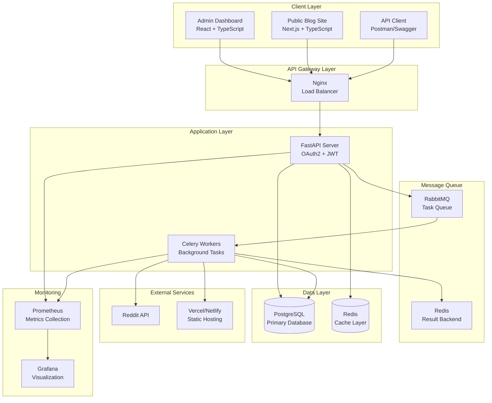
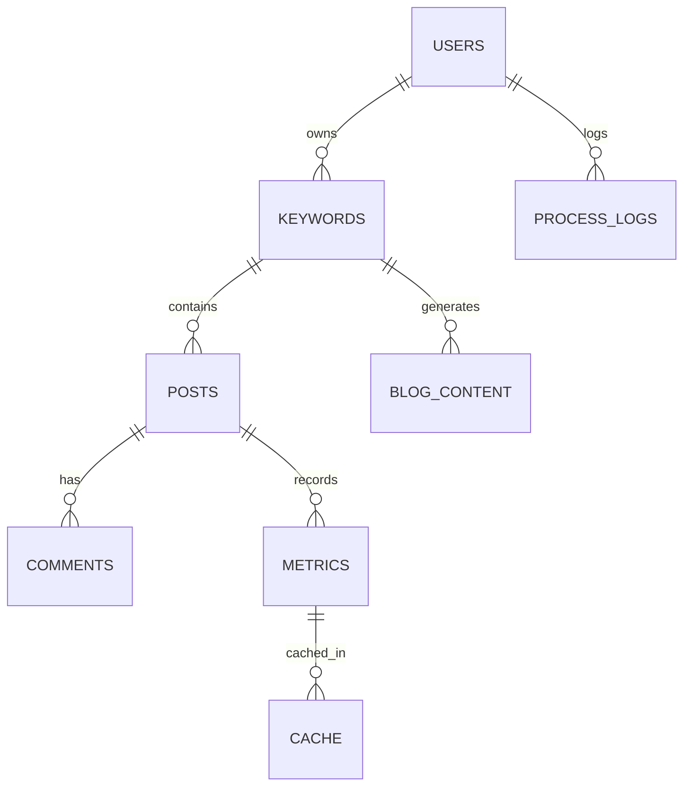

# Design Document

## Overview

Reddit 컨텐츠 크롤링 및 블로그 생성 플랫폼은 마이크로서비스 아키텍처를 기반으로 한 비동기 처리 시스템입니다. FastAPI를 사용한 RESTful API 서버, Celery 기반의 백그라운드 작업 처리, 그리고 PostgreSQL과 Redis를 활용한 데이터 저장 및 캐싱 시스템으로 구성됩니다.

시스템은 사용자 인증, 키워드 관리, Reddit 크롤링, 트렌드 분석, 컨텐츠 생성, 그리고 자동 배포의 6개 주요 도메인으로 분리되어 있으며, 각 도메인은 독립적으로 확장 가능하도록 설계되었습니다.

## Architecture

### System Architecture



### Technology Stack

- **Backend Framework**: FastAPI v1 with Pydantic for data validation
- **Authentication**: OAuth2 with JWT tokens and refresh token mechanism
- **Task Queue**: Celery with RabbitMQ as message broker
- **Databases**: PostgreSQL (primary), Redis (cache/session/queue)
- **API Documentation**: Swagger/OpenAPI with Postman collections
- **Monitoring**: Prometheus metrics with Grafana dashboards
- **Deployment**: Docker containers with GitHub Actions CI/CD

## Components and Interfaces

### 1. Authentication Service

**Purpose**: OAuth2 기반 사용자 인증 및 JWT 토큰 관리

**Key Components**:
- `AuthService`: OAuth2 플로우 처리 및 토큰 생성/검증
- `TokenManager`: JWT 액세스/리프레시 토큰 관리
- `AuthMiddleware`: API 요청 인증 미들웨어

**Interfaces**:
```python
class AuthService:
    async def authenticate_user(oauth_code: str) -> UserToken
    async def refresh_token(refresh_token: str) -> UserToken
    async def verify_token(access_token: str) -> User

class TokenManager:
    def create_access_token(user_id: int) -> str
    def create_refresh_token(user_id: int) -> str
    def verify_token(token: str) -> TokenPayload
```

### 2. Keyword Management Service

**Purpose**: 사용자별 키워드 CRUD 관리

**Key Components**:
- `KeywordService`: 키워드 비즈니스 로직
- `KeywordRepository`: 데이터베이스 접근 계층

**Interfaces**:
```python
class KeywordService:
    async def create_keyword(user_id: int, keyword: str) -> Keyword
    async def get_user_keywords(user_id: int) -> List[Keyword]
    async def update_keyword(keyword_id: int, new_keyword: str) -> Keyword
    async def delete_keyword(keyword_id: int) -> bool
```

### 3. Reddit Crawling Service

**Purpose**: Reddit API를 통한 컨텐츠 수집 및 저장

**Key Components**:
- `RedditCrawler`: Reddit API 클라이언트
- `CrawlScheduler`: 크롤링 작업 스케줄링
- `PostProcessor`: 수집된 데이터 전처리

**Interfaces**:
```python
class RedditCrawler:
    async def fetch_posts_by_keyword(keyword: str, limit: int) -> List[RedditPost]
    async def fetch_post_comments(post_id: str) -> List[Comment]
    
class CrawlScheduler:
    def schedule_crawl_task(keyword_id: int) -> str  # Returns task_id
    def get_crawl_status(task_id: str) -> TaskStatus
```

### 4. Trend Analysis Service

**Purpose**: TF-IDF 기반 트렌드 분석 및 메트릭 생성

**Key Components**:
- `TrendAnalyzer`: TF-IDF 알고리즘 구현
- `MetricsCalculator`: 트렌드 메트릭 계산
- `CacheManager`: Redis 캐시 관리

**Interfaces**:
```python
class TrendAnalyzer:
    async def analyze_keyword_trends(keyword_id: int) -> TrendMetrics
    async def calculate_tfidf_scores(posts: List[Post]) -> Dict[str, float]
    
class MetricsCalculator:
    def calculate_engagement_score(post: Post) -> float
    def calculate_trend_velocity(metrics: List[Metric]) -> float
```

### 5. Content Generation Service

**Purpose**: 트렌드 데이터 기반 마크다운 블로그 컨텐츠 생성

**Key Components**:
- `ContentGenerator`: 마크다운 컨텐츠 생성 엔진
- `TemplateManager`: 블로그 템플릿 관리
- `ContentValidator`: 생성된 컨텐츠 검증

**Interfaces**:
```python
class ContentGenerator:
    async def generate_blog_post(trend_data: TrendMetrics) -> BlogContent
    async def apply_template(content: str, template: str) -> str
    
class TemplateManager:
    def get_template_by_type(template_type: str) -> Template
    def validate_template(template: str) -> bool
```

### 6. Frontend Applications

**Purpose**: 사용자 인터페이스 제공 - 관리자 대시보드와 공개 블로그 사이트

**Admin Dashboard Components**:
- `AuthProvider`: 인증 상태 관리
- `DashboardLayout`: 관리자 대시보드 레이아웃
- `KeywordManager`: 키워드 관리 인터페이스
- `CrawlingMonitor`: 크롤링 상태 모니터링
- `ContentEditor`: 컨텐츠 편집 및 관리
- `AnalyticsDashboard`: 트렌드 분석 시각화

**Public Blog Site Components**:
- `BlogLayout`: 블로그 사이트 레이아웃
- `PostList`: 블로그 포스트 목록
- `PostDetail`: 개별 포스트 상세 페이지
- `SearchFilter`: 검색 및 필터링
- `CategoryNavigation`: 카테고리 네비게이션

**Interfaces**:
```typescript
// Admin Dashboard
interface AdminDashboardProps {
  user: User;
  onLogout: () => void;
}

interface KeywordManagerProps {
  keywords: Keyword[];
  onAdd: (keyword: string) => void;
  onUpdate: (id: number, keyword: string) => void;
  onDelete: (id: number) => void;
}

// Public Blog Site
interface BlogPostProps {
  post: BlogPost;
  showExcerpt?: boolean;
}

interface SearchFilterProps {
  onSearch: (query: string) => void;
  onFilter: (category: string) => void;
}
```

## Data Models

### Core Entities

```python
# User Management
class User(BaseModel):
    id: int
    name: str
    email: str
    oauth_provider: str
    created_at: datetime
    updated_at: datetime

# Keyword Management
class Keyword(BaseModel):
    id: int
    user_id: int
    keyword: str
    is_active: bool
    created_at: datetime
    
# Content Storage
class Post(BaseModel):
    id: int
    keyword_id: int
    reddit_id: str
    title: str
    content: str
    author: str
    score: int
    num_comments: int
    url: str
    created_at: datetime
    
class Comment(BaseModel):
    id: int
    post_id: int
    reddit_id: str
    body: str
    author: str
    score: int
    created_at: datetime

# Analytics
class Metric(BaseModel):
    id: int
    post_id: int
    engagement_score: float
    tfidf_score: float
    trend_velocity: float
    calculated_at: datetime
    
# Content Generation
class BlogContent(BaseModel):
    id: int
    keyword_id: int
    title: str
    content: str  # Markdown format
    template_used: str
    generated_at: datetime
    
# Process Tracking
class ProcessLog(BaseModel):
    id: int
    user_id: int
    task_type: str
    status: str  # pending, running, completed, failed
    task_id: str
    error_message: Optional[str]
    created_at: datetime
    completed_at: Optional[datetime]
```

### Database Schema Relationships



## Error Handling

### Error Classification

1. **Client Errors (4xx)**
   - 400 Bad Request: 잘못된 요청 파라미터
   - 401 Unauthorized: 인증 실패
   - 403 Forbidden: 권한 부족
   - 404 Not Found: 리소스 없음
   - 422 Unprocessable Entity: 데이터 검증 실패

2. **Server Errors (5xx)**
   - 500 Internal Server Error: 예상치 못한 서버 오류
   - 502 Bad Gateway: 외부 API 호출 실패
   - 503 Service Unavailable: 서비스 일시 중단

### Error Response Format

```python
class ErrorResponse(BaseModel):
    error_code: str
    message: str
    details: Optional[Dict[str, Any]]
    timestamp: datetime
    request_id: str
```

### Retry Mechanisms

- **Reddit API 호출**: 지수 백오프로 최대 3회 재시도
- **데이터베이스 연결**: 연결 풀 관리 및 자동 재연결
- **외부 배포 API**: 플랫폼별 재시도 정책 적용

## Testing Strategy

### Unit Testing
- **Coverage Target**: 80% 이상
- **Framework**: pytest with pytest-asyncio
- **Mocking**: unittest.mock for external dependencies
- **Database**: SQLite in-memory for fast testing

### Integration Testing
- **API Testing**: TestClient를 사용한 엔드투엔드 테스트
- **Database Testing**: PostgreSQL 테스트 컨테이너
- **Redis Testing**: fakeredis 라이브러리 활용

### Performance Testing
- **Load Testing**: locust를 사용한 API 부하 테스트
- **Database Performance**: 쿼리 실행 계획 분석
- **Memory Profiling**: memory_profiler를 사용한 메모리 사용량 모니터링

### Test Data Management
- **Fixtures**: pytest fixtures for test data setup
- **Factory Pattern**: factory_boy를 사용한 테스트 데이터 생성
- **Database Seeding**: 개발/테스트 환경용 시드 데이터

### Continuous Integration
- **GitHub Actions**: 코드 푸시 시 자동 테스트 실행
- **Test Stages**: Lint → Unit Tests → Integration Tests → Build
- **Coverage Reporting**: codecov를 통한 커버리지 리포팅

### Monitoring and Observability
- **Health Checks**: `/health` 엔드포인트로 서비스 상태 확인
- **Metrics Collection**: Prometheus를 통한 비즈니스 메트릭 수집
- **Logging**: 구조화된 JSON 로그 with correlation IDs
- **Alerting**: Grafana 알림을 통한 장애 감지